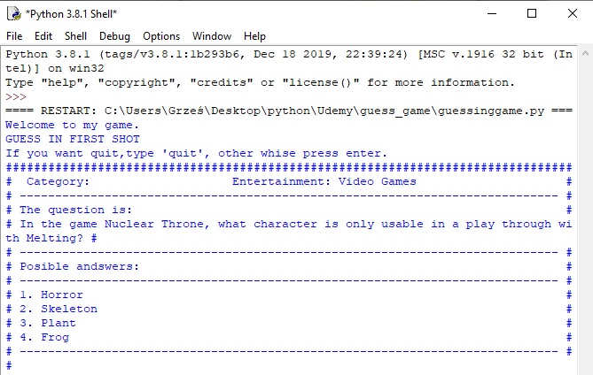

 guessing_game

 # ######Guessing game######

Made by Rayan

#### 1. General info.
#### 2. Technologies.
#### 3. Setup.
#### 4. Status.
#### 5. To Do.
#### 6. Sources.

### General info.

Program created to find out how much do you know about our world.
Program uses free webside with automaic generated questions link: https://opentdb.com/api_config.php.
Exemple how it look wile running program:

### Technologies.

I used 4 modules:
* Requests (2.23.0)
* Pprint (0.1)
* Json
* Html
And Python (3.8.1)

### Setup.

You need only an IDLE for python and those 4 modules.
For istalling Requests, Pprint, Json and Html on your powershell(for windows) type
"pip install requests",
"pip install pprint",
"pip install json".
Or visit web site 
https://requests.readthedocs.io/en/master/ 
https://pypi.org/project/pprintpp/
https://stackoverflow.com/questions/1389141/how-to-add-json-library
There is instruction on how to install on all systems.
Module html is already instaled on your computer.

### Status.

Wrigt now you can type one andswer and see your score after ending game.
Game ends after you type 'quit' on end of each round.
Add levels and a category to choose before start game. 
Want to fix bugs wit wrong answers and table bugs.
-----UPDATE-----
Fixet only 2 bugs, with typing andswer number and letter.
Still need to fix "quit option".
Added save save your score to new file.

### To Do.

For now:
* average time for andswer
* total time wile playing
* add difficult levels
* add category to choose
* fix bugs after typing wrong word or sign

### Sources.

This app is inspired by Ivan Lourenço Gomes course "Learn to Code in Python 3: Programming beginner to advanced"
on Udemy: https://www.udemy.com/course/learn-python-programming-a-step-by-step-course-to-beginners/

